<!--
────────────────────────────────────────────────────────────────
  MAINTENANCE GUIDE
  Everything you need to edit is marked with «REPLACE_ME» tokens.
  Search this file for «  to find every one of them.
  Assets live in assets/ and are plain hand-written SVG — edit the
  text inside them directly, no build step, no dependencies.
────────────────────────────────────────────────────────────────
-->

Almaty, Kazakhstan. I build web applications, backend services and practical AI/data systems —
and I take them all the way to a running deployment rather than stopping at a prototype.

---

### What I build

**Interfaces** — Web and cross-platform apps with Next.js, React, React Native and Flutter.
Multilingual by default; most of what I ship runs in three languages.

**Backend systems** — HTTP APIs and services in FastAPI and Node.js on PostgreSQL, with the
auth, background work and data modelling that go with them.

**AI / Data** — Machine-learning work and applied LLM systems: retrieval pipelines, RAG over
domain documents, and the evaluation harnesses that keep them honest.

**Infrastructure** — Containerised deployments behind Nginx, CI/CD pipelines, and the Linux
servers underneath.

---

### Selected projects

<!-- «REPLACE_ME» — fill in the two URLs on each line. Delete the ones you don't want public.
     Format:  **Name** — one line of what it does.
              `tech` `tech` · [Code](url) · [Live](url)                                    -->

**MamaCare** — Healthcare assistant with a retrieval-backed chat interface and its own QA /
evaluation framework.
`FastAPI` `Next.js` `RAG` `LLM` · [Code](«REPLACE_ME_GITHUB_URL») · [Live](«REPLACE_ME_LIVE_URL»)

**BFHI Smart Monitor** — Compliance tracking platform for health facilities, with an LMS
module and analytics dashboards.
`FastAPI` `Next.js` `PostgreSQL` `Docker` · [Code](«REPLACE_ME_GITHUB_URL») · [Live](«REPLACE_ME_LIVE_URL»)

**GreenTech Horizons** — Trilingual eLearning platform built for an EU-funded programme
(grant №101177203).
`Next.js` `React` `i18n` · [Code](«REPLACE_ME_GITHUB_URL») · [Live](«REPLACE_ME_LIVE_URL»)

**«REPLACE_ME_PROJECT_NAME»** — «REPLACE_ME_ONE_LINE_DESCRIPTION»
`«tech»` `«tech»` · [Code](«REPLACE_ME_GITHUB_URL») · [Live](«REPLACE_ME_LIVE_URL»)

---

### Currently

- Full-stack applications on Next.js + FastAPI
- Applied LLM / RAG systems and their evaluation
- Data Science coursework and research
- Deployment and CI/CD automation

---

### Stack

<!-- Icons come from the devicon CDN (static files on jsDelivr — no runtime service).
     To add one:  https://cdn.jsdelivr.net/gh/devicons/devicon@latest/icons/<name>/<name>-original.svg
     Next.js is a black logo, so it uses <picture> to stay visible in both GitHub themes. -->

<table>
<tr><td><b>Languages</b></td><td>

</td></tr>

<tr><td><b>Frontend</b></td><td>
<picture title="Next.js">
  <source media="(prefers-color-scheme: dark)" srcset="https://cdn.simpleicons.org/nextdotjs/white">
  
</picture>

</td></tr>

<tr><td><b>Backend</b></td><td>

</td></tr>

<tr><td><b>Infrastructure</b></td><td>

</td></tr>

<tr><td><b>Data / AI</b></td><td>Machine Learning · LLM applications · RAG</td></tr>
</table>

---

### Background

Not a purely commercial path — the research side shapes how I build.

- **Al-Farabi Kazakh National University** — Data Science
- **Vilnius Tech** — Erasmus+ academic exchange
- **China** — international internship
- Research and AI work in applied health-tech projects

---

### Building consistently, one commit at a time

<!-- Generated in this repository by .github/workflows/snake.yml — no third-party runtime
     service, so it cannot break on you. It commits to the `output` branch every 12h.
     After your first push: Actions → "generate contribution graph" → Run workflow.       -->

<picture>
  <source media="(prefers-color-scheme: dark)" srcset="https://raw.githubusercontent.com/av1cu/av1cu/output/snake-dark.svg">
  <source media="(prefers-color-scheme: light)" srcset="https://raw.githubusercontent.com/av1cu/av1cu/output/snake.svg">
  
</picture>

---

### Contact

[«REPLACE_ME_EMAIL»](mailto:«REPLACE_ME_EMAIL») &nbsp;·&nbsp;
[LinkedIn](«REPLACE_ME_LINKEDIN_URL») &nbsp;·&nbsp;
[Portfolio](«REPLACE_ME_PORTFOLIO_URL») &nbsp;·&nbsp;
[@av1cu](https://github.com/av1cu)

Almaty, Kazakhstan · open to research collaborations and full-stack / AI work
